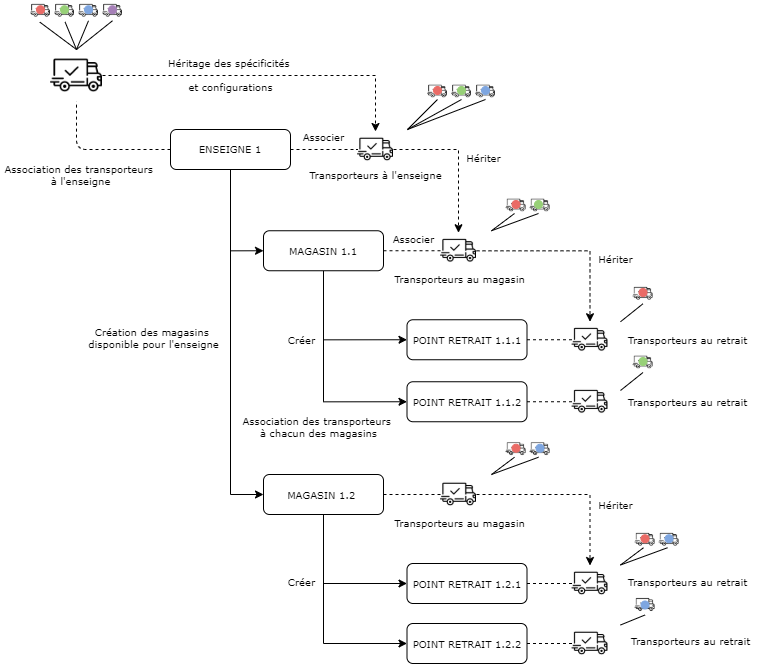

# Point de prélèvement

Un point de prélèvement dit `exchangePlace` représente un point physique de ramasse rattaché directement à un magasin. 

Le point de prélèvement précise la nature du lieu ainsi que certaines informations sur l'adresse de prélèvement. Les paramètres, configurations et spécifications dépendent du magasin. 

La congfiguration établie au sein de la plateforme est la suivante : 
- L'enseigne contractualise avec un ensemble de transporteurs et configure ses magasins en son nom. 
- Chaque magasin hérite de la configuration et des caractéristiques des transporteurs de son enseigne. 
- Le magasin, en son propre chef, a la possibilité d'affiner la configuration de ses transporteurs hérités. 
- Le magasin configure à son tour un ensemble de point de prélèvement (lieu de ramasse physique de la marchandise) en son nom. 
- Chaque point de prélèvement hérite de la configuration et des caractéristiques des transporteurs de son magasin. 
- Le point de prélèvement a également, à ce stade, la possibilité d'affiner la configuration de ses transporteurs hérités. 