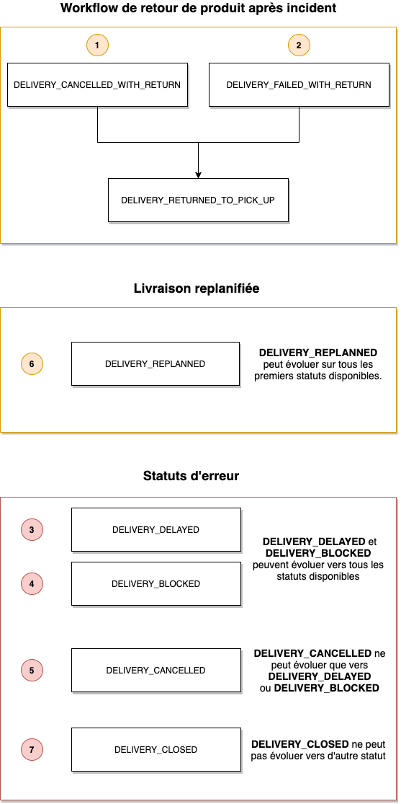

# Delivery status

The delivery goes through several statuses in succession. We identify the different stages of the delivery.

### Route of an order

### List of possible delivery statuses

| Statut                          | Sous-statut          | Intitulé                                                             | Exemples de commentaire                                                                                                                                                                                                                                                                                                                                                                                                                           |
| ------------------------------- | -------------------- | -------------------------------------------------------------------- | ------------------------------------------------------------------------------------------------------------------------------------------------------------------------------------------------------------------------------------------------------------------------------------------------------------------------------------------------------------------------------------------------------------------------------------------------- |
| `DELIVERY_INIT`                 | --                   | Validated carrier                                                    | "N/A"                                                                                                                                                                                                                                                                                                                                                                                                                                             |
| `DELIVERY_TEAM_ASSIGNED`        | --                   | Delivery received to a Courier                                       | "N/A"                                                                                                                                                                                                                                                                                                                                                                                                                                             |
| `DELIVERY_PICK_UP_STARTED`      | --                   |  Courier near to the store                                           | "N/A"                                                                                                                                                                                                                                                                                                                                                                                                                                             |
| `DELIVERY_PICK_UP_REACHED`      | --                   | Courier arrived at the store                                         | "N/A"                                                                                                                                                                                                                                                                                                                                                                                                                                             |
| `DELIVERY_PICK_UP_OK`           | --                   | Deliverey collected                                                  | "N/A"                                                                                                                                                                                                                                                                                                                                                                                                                                             |
| `DELIVERY_PICK_UP_KO`           | `FAILED_WITH_RETRY`  | Delivery error at picking with retry                                 | "The order was not ready"  "No salesman present/available on site to collect the goods"  "Missing packages (some carriers refuse partial collections)"  "Insufficient packaging (a packaging defect on a fragile product can be a reason for refusal)"  "Inaccessible or closed collection site"  "Excessive waiting time (contractually some carriers may refuse a collection because they have waited more than x minutes)" |
| `DELIVERY_PICK_UP_KO`           | `FAILED`             | Delivery error at picking                                            | "The order was not ready"  "No salesman present/available on site to collect the goods"  "Missing packages (some carriers refuse partial collections)"  "Insufficient packaging (a packaging defect on a fragile product can be a reason for refusal)"  "Inaccessible or closed collection site"  "Excessive waiting time (contractually some carriers may refuse a collection because they have waited more than x minutes)" |
| `DELIVERY_IN_TRANSIT`           | --                   | In transit                                                           | "N/A"                                                                                                                                                                                                                                                                                                                                                                                                                                             |
| `DELIVERY_IN_PROGRESS`          | --                   | Order in process of delivery                                         | "N/A"                                                                                                                                                                                                                                                                                                                                                                                                                                             |
| `DELIVERY_AT_DROP_OFF_LOCATION` | --                   | Courier arriving at the customer location                            | "N/A"                                                                                                                                                                                                                                                                                                                                                                                                                                             |
| `DELIVERY_OK`                   | --                   | Order delivered correctly                                            | "N/A"                                                                                                                                                                                                                                                                                                                                                                                                                                             |
| `DELIVERY_OK`                   | `WITH_CLAIM`         | Order delivered with reserves                                        | "The customer has accepted the order with the following reserves"                                                                                                                                                                                                                                                                                                                                                                                 |
| `DELIVERY_KO`                   | `FAILED_WITH_RETRY`  | Failed delivery with retry                                           | "N/A"                                                                                                                                                                                                                                                                                                                                                                                                                                             |
| `DELIVERY_KO`                   | `FAILED_WITH_RETURN` | Failed delivery with return to store                                 | "The customer was not there"  "Error in the delivery address"  "Access problem"  "The Product does not correspond to what the customer ordered"  "The Product is damaged"  "The customer refuses delivery (they may no longer want it, some do not pick up their product at the relay point.)"                                                                                                                                |
| `DELIVERY_KO`                   | `REFUSED`            | Delivery refused by recipient                                        | “Le client a refusé"                                                                                                                                                                                                                                                                                                                                                                                                                              |
| `DELIVERY_KO`                   | `NOT_COLLECTED`      | Not withdrawn by recipient                                           | "N/A"                                                                                                                                                                                                                                                                                                                                                                                                                                             |
| `DELIVERY_RETURNED_TO_SENDER`   | --                   |     Delivery returned to sender/store | "N/A"                                                                                                                                                                                  |
| `DELIVERY_CANCELLED`            | --                   | Delivery cancelled                                                   | "Our teams are no longer able to make this delivery {raison}"  reason: "vehicle broken down "  "no delivery person available"  "no vehicle available"                                                                                                                                                                                                                                                                                 |
| `DELIVERY_CANCELLED`            | `CLOSED`             | Delivery closed                                                      | "N/A"                                                                                                                                                                                                                                                                                                                                                                                                                                             |
| `DELIVERY_BLOCKED`              | --                   | Delivery blocked                                                     | "Customs Inspection" "Truck blocked by bad weather" "Truck blocked by traffic"                                                                                                                                                                                                                                                                                                                                                            |
| `DELIVERY_DELAYED`              | --                   | Delivery delayed                                                     | "Customs Inspection" "Truck blocked by bad weather" "Truck blocked by traffic"                                                                                                                                                                                                                                                                                                                                                            |
| `DELIVERY_AVAILABLE`            | --                   | Delivery available at collection points                              | "N/A"                                                                                                                                                                                                                                                                                                                                                                                                                                             |
| `DELIVERY_REPLANNED`            | --                   | Delivery date rescheduled by making an appointment with the customer | "N/A"                                                                                                                                                                                                                                                                                                                                                                                                                                             |

### SubStatuts & use case

### Returns and error management

