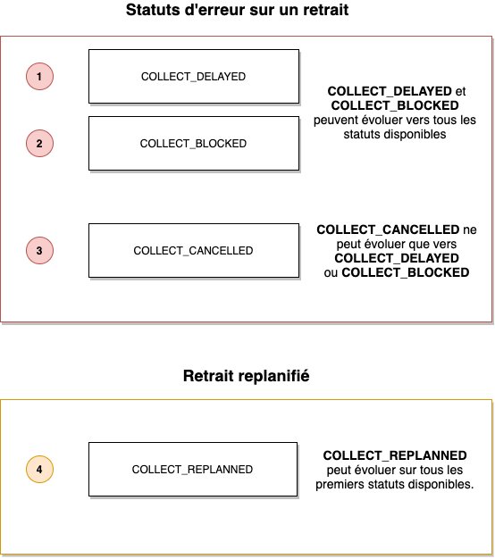

# Status of C&C collection

The click & collect collection request goes through several statuses in succession. We identify the different stages of the order.

### Process for a collection request

### List of possible delivery statuses

| Status                      | Title                                            | Description                                                                                  |
| --------------------------- | ------------------------------------------------ | -------------------------------------------------------------------------------------------- |
| `COLLECT_INIT`              | Initialization of the order                      | Collection request retrieved by Woop.                                                        |
| `COLLECT_STOCK_OK`          | Stock verified                                   | The requested product is available for C&C collection                                        |
| `COLLECT_STARTED`           | Time slot validated                              | The C&C collection time slot has been validated by the customer                              |
| `COLLECT_READY`             | Order ready                                      | C&C preparation completed in store, customer order ready                                     |
| `COLLECT_AWAITING`          | Customer has arrived at the store                | The customer has arrived at the store and is waiting to be assisted by a salesperson         |
| `COLLECT_IN_PROGRESS`       | Collection in progress                           | The store assists the customer                                                               |
| `COLLECT_PICK_UP_OK`        | Collection completed                             | The C&C order was successfully picked-up by the customer                                     |
| `COLLECT_PICK_UP_FAILED`    | Collection failed                                | The C&C order has not been picked-up by the customer                                         |
| `COLLECT_PICK_UP_PARTIALLY` | Partial collection                               | Not all of the C&C order has been picked-up by the customer and will need to be rescheduled. |
| `COLLECT_CANCELLED`         | C&C collection cancelled                         | The C&C order has been cancelled                                                             |
| `COLLECT_BLOCKED`           | C&C collection blocked                           | The C&C order is blocked and cannot be completed                                             |
| `COLLECT_DELAYED`           | C&C collection delayed                           | The C&C order is delayed for various reasons related to the store                            |
| `COLLECT_REPLANNED`         | Collection time slot rescheduled by the customer | The C&C order has been rescheduled to another time slot                                      |

### Error handling

