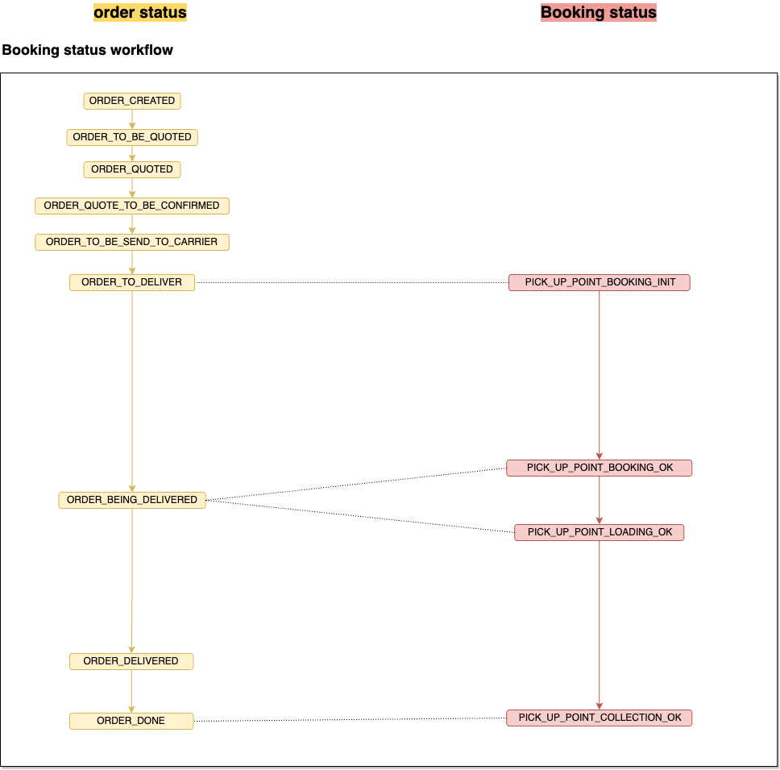
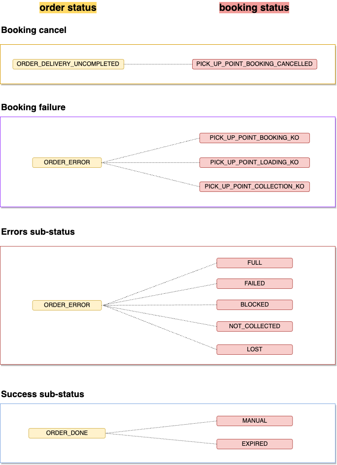

# Order and booking concept

At Woop, it is possible to book a locker pickup-point. The reservation is made directly via our systems and creates a unique link with the customer order. 

These two concepts have very different life cycles with important links between each booking stage. 

### Link between order and booking cycle

Default workflow booking and order statuses

List of the booking statuses and order linked.

| Order status                 | Booking Status                      |
| ---------------------------- | ------------------------------------ |
| `ORDER_TO_DELIVER`           | ` PICK_UP_POINT_BOOKING_INIT`					  |
| `ORDER_BEING_DELIVERED`      | ` PICK_UP_POINT_BOOKING_OK`	`PICK_UP_POINT_LOADING_OK`|
| `ORDER_DONE`            | ` PICK_UP_POINT_COLLECTION_OK`      |

### SubStatuts and error management

List of the booking statuses and order linked.

| Order status                 | Booking Status                      |
| ---------------------------- | ------------------------------------ |
| `ORDER_ERROR`      | `PICK_UP_POINT_BOOKING_KO` `PICK_UP_POINT_COLLECTION_KO`  `PICK_UP_POINT_LOADING_KO`  `FULL` `FAILED` `BLOCKED` `NOT_COLLECTED` `LOST`          |
| `ORDER_DELIVERY_UNCOMPLETED` |`PICK_UP_POINT_BOOKING_CANCELLED`|
| `ORDER_DONE`            | `MANUAL`    `EXPIRED`                   |

