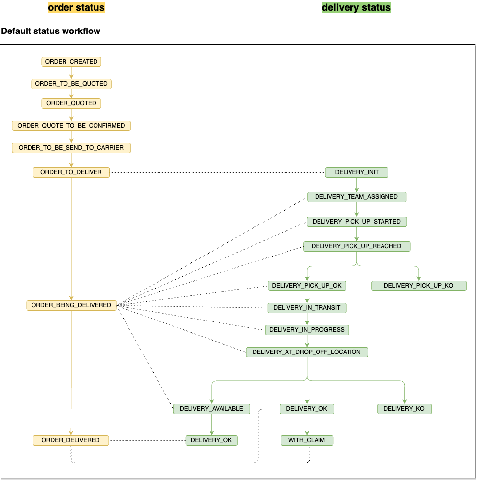
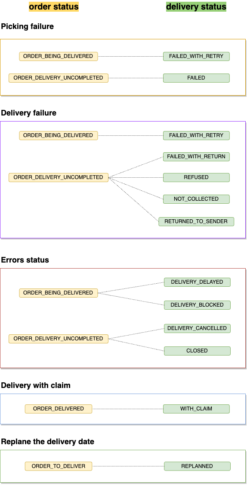

# Order and delivery concept

At Woop there are two distinct business units with very different roles: 
- The customer order 
- The delivery of this order

These two notions have different life cycles with important links their workflow steps. 

The customer order is present during the time of the eligibility and the orchestration of the carriers. Once the best carrier has been identified, the delivery is created. At this level, the links between the two entities exist. 

### Link between order and delivery

Default workflow delivery and order statuses

List of the delivery statuses and order linked.

| Order status                 | Delivery Status                      |
| ---------------------------- | ------------------------------------ |
| `ORDER_TO_DELIVER`           | `DELIVERY_INIT`					  |
| `ORDER_BEING_DELIVERED`      | `DELIVERY_TEAM_ASSIGNED`	`DELIVERY_PICK_UP_STARTED`	`DELIVERY_PICK_UP_REACHED`	`DELIVERY_PICK_UP_OK`	`DELIVERY_IN_TRANSIT`	`DELIVERY_IN_PROGRESS`	`DELIVERY_AT_DROP_OFF_LOCATION`	`DELIVERY_AVAILABLE`	|
| `ORDER_DELIVERED`            | `DELIVERY_OK`  `DELIVERY_WITH_CLAIM`	      |

### SubStatuts, returns and error management

List of the delivery statuses and order linked.

| Order status                 | Delivery Status                      |
| ---------------------------- | ------------------------------------ |
| `ORDER_BEING_DELIVERED`      | `DELIVERY_FAILED_WITH_RETRY` `DELIVERY_DELAYED`  `DELIVERY_BLOCKED`           |
| `ORDER_DELIVERY_UNCOMPLETED` |`DELIVERY_RETURNED_TO_SENDER` `DELIVERY_CANCELLED`  `DELIVERY_CLOSED`  `DELIVERY_FAILED` `DELIVERY_FAILED_WITH_RETURN`  `DELIVERY_REFUSED` `DELIVERY_NOT_COLLECTED`|
| `ORDER_DELIVERED`            | `DELIVERY_WITH_CLAIM`                       |
| `ORDER_TO_DELIVER`           | `DELIVERY_REPLANNED`               |

