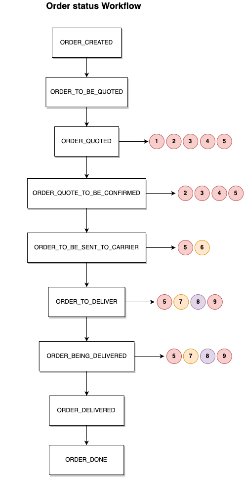
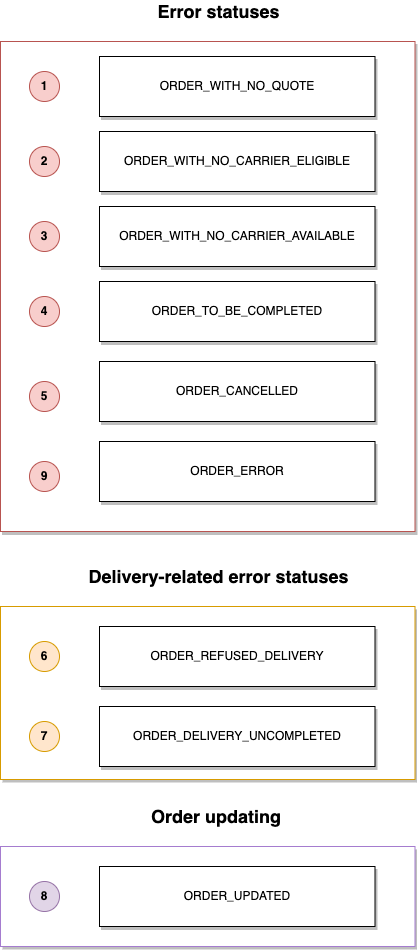

# Order status & states

During its life cycle, an order goes through several :

- order status
- order states

## Order status

### Route of an order

### List of possible order statuses

| Status                            | Title                    | Description                                                                |
| --------------------------------- | ------------------------ | -------------------------------------------------------------------------- |
| `ORDER_CREATED`                   | Order registered         | The order has been successfully registered by woop.                        |
| `ORDER_UPDATED`                   | Modified order           | The order has been modified.                                               |
| `ORDER_TO_BE_QUOTED`              | Waiting for a quote      | The request for a quote has been sent to carriers.                         |
| `ORDER_QUOTED`                    | Quote under analysis     | The quotes received are currently being analysed by the scheduling system. |
| `ORDER_QUOTE_TO_BE_CONFIRMED`     | Awaiting confirmation    | The quote is awaiting confirmation by carriers.                            |
| `ORDER_TO_BE_SENT_TO_CARRIER`     | Delivery to be confirmed | The quote is selected and is waiting for a delivery identifier.            |
| `ORDER_TO_DELIVER`                | Order to be delivered    | The order is ready to be delivered by the selected carrier.                |
| `ORDER_BEING_DELIVERED`           | Delivery in progress     | Delivery of the order in progress.                                         |
| `ORDER_DELIVERED`                 | Order delivered          | The order has been successfully delivered.                                 |
| `ORDER_WITH_NO_CARRIER_ELIGIBLE`  | No carrier               | No carriers selected from scheduling.                                      |
| `ORDER_WITH_NO_CARRIER_AVAILABLE` | Carriers unavailable     | No carrier available for the quotes sent. All responses are negative.      |
| `ORDER_WITH_NO_QUOTE`             | No quote                 | No quotes received from the carriers contacted.                            |
| `ORDER_DELIVERY_UNCOMPLETED`      | Delivery not complete    | In-progess delivery is not complete.                                       |
| `ORDER_TO_BE_COMPLETED`           | Order to be completed    | Order to be completed with missing information.                            |
| `ORDER_CANCELLED`                 | Order cancelled          | The order has been cancelled.                                              |
| `ORDER_REFUSED_DELIVERY`          | Order refused            | The order has been refused by the carriers.                                |
| `ORDER_ERROR`         | Order error           | Order error related to a locker reservation.                                |
| `ORDER_DONE`          | Order received             | The order is received in a locker relay point.                  |

### Returns and error management

## Order states

### List of possible order states

| States                  | Title                                                        |
| ----------------------- | ------------------------------------------------------------ |
| `ORDER_TO_BE_COMPLETED` | Order awaiting further information. Request to be completed. |
