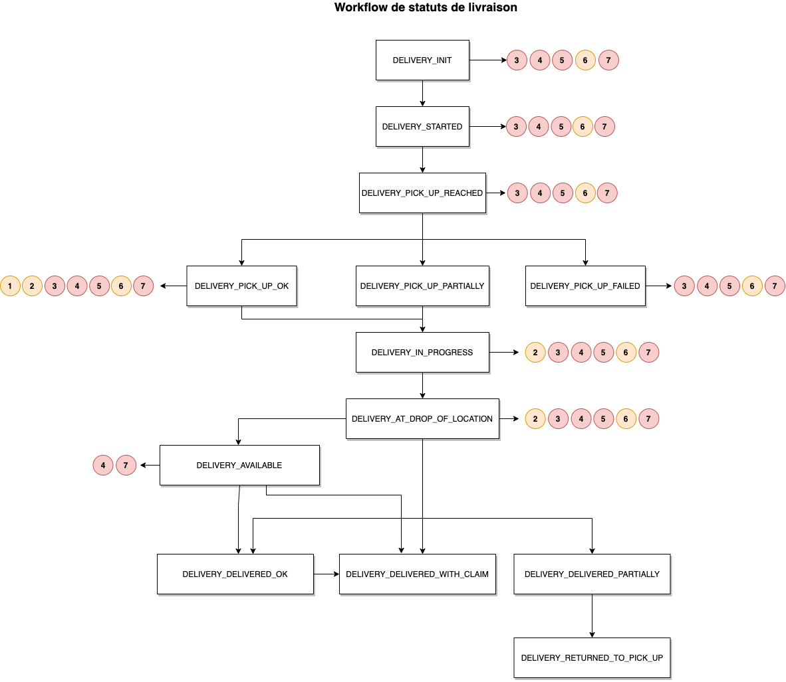

# Statuts de livraison

Au cours de son cycle de vie la livraison passe tour à tour par plusieurs statuts. Ceux que nous identifions sont les différents stades de la livraison. 

### Parcours d'une commande

### Liste des statuts de livraison possible

Statut | Intitulé
---------|----------
 `DELIVERY_INIT`|Validée transporteur
 `DELIVERY_STARTED`|Coursier en approche magasin
 `DELIVERY_PICK_UP_REACHED`|Coursier arrivé en magasin
 `DELIVERY_PICK_UP_OK`|Commande prise en charge
 `DELIVERY_PICK_UP_FAILED`|Commande en échec au retrait
 `DELIVERY_PICK_UP_PARTIALLY`|Commande prise en charge partiellement
 `DELIVERY_IN_PROGRESS`|Commande en cours de livraison
 `DELIVERY_AT_DROP_OF_LOCATION`|Coursier arrivé client
 `DELIVERY_DELIVERED_OK`|Commande livrée conforme
 `DELIVERY_DELIVERED_WITH_CLAIM`|Commande livrée avec réserves
 `DELIVERY_DELIVERED_PARTIALLY`|Commande prise en charge partiellement
 `DELIVERY_FAILED_WITH_RETURN`|Livraison en échec avec retour magasin
 `DELIVERY_RETURNED_TO_PICK_UP`|Commande retournée en magasin
 `DELIVERY_CANCELLED`|Livraison annulée
 `DELIVERY_CANCELLED_WITH_RETURN`|Livraison annulée avec retour magasin
 `DELIVERY_BLOCKED`|Livraison bloquée
 `DELIVERY_DELAYED`|Livraison retardée 
 `DELIVERY_AVAILABLE`|Livraison disponible en point de retrait
 `DELIVERY_REPLANNED`|Date de livraison replannifiée par une prise de RDV avec le client
 `DELIVERY_CLOSED`|Livraison clôturée à la demande de l'enseigne 

Les statuts `DELIVERY_PICK_UP_PARTIALLY` et `DELIVERY_DELIVERED_PARTIALLY` sont réservés à la livraison et ne sont pas autorisés pour le suivi de colis.

### Gestion des retours et des erreurs

