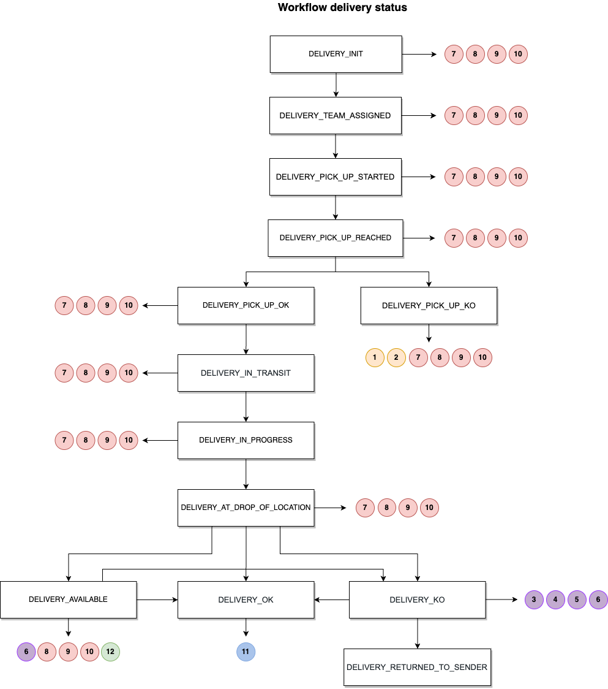

# Delivery status

The delivery goes through several statuses in succession. We identify the different stages of the delivery. 

### Route of an order

### List of possible delivery statuses

Status | Title
---------|----------
 `DELIVERY_INIT`|Validated carrier
 `DELIVERY_STARTED`|Courier near to the store
 `DELIVERY_PICK_UP_REACHED`|Courier arrived at the store
 `DELIVERY_PICK_UP_OK`|Order collected
 `DELIVERY_PICK_UP_FAILED`|Order failed at collection
 `DELIVERY_PICK_UP_PARTIALLY`|Partial orders managed
 `DELIVERY_IN_PROGRESS`|Order in process of delivery
 `DELIVERY_AT_DROP_OF_LOCATION`|Courier arriving at the customer location
 `DELIVERY_DELIVERED_OK`|Order delivered correctly
 `DELIVERY_DELIVERED_WITH_CLAIM`|Order delivered with reserves
 `DELIVERY_DELIVERED_PARTIALLY`|Partial orders managed
 `DELIVERY_FAILED_WITH_RETURN`|Failed delivery with return to store
 `DELIVERY_RETURNED_TO_PICK_UP`|Order returned to store
 `DELIVERY_CANCELLED`|Delivery cancelled
 `DELIVERY_CANCELLED_WITH_RETURN`|Delivery cancelled with return to store
 `DELIVERY_BLOCKED`|Delivery blocked
 `DELIVERY_DELAYED`|Delivery delayed 
 `DELIVERY_AVAILABLE`|Delivery available at collection points
 `DELIVERY_REPLANNED`|Delivery date rescheduled by making an appointment with the customer
 `DELIVERY_CLOSED`|Delivery closed at the brand's request 

Statuses `DELIVERY_PICK_UP_PARTIALLY` and `DELIVERY_DELIVERED_PARTIALLY` are reserved for delivery only and are not allowed for tracking packages.

### Returns and error management

