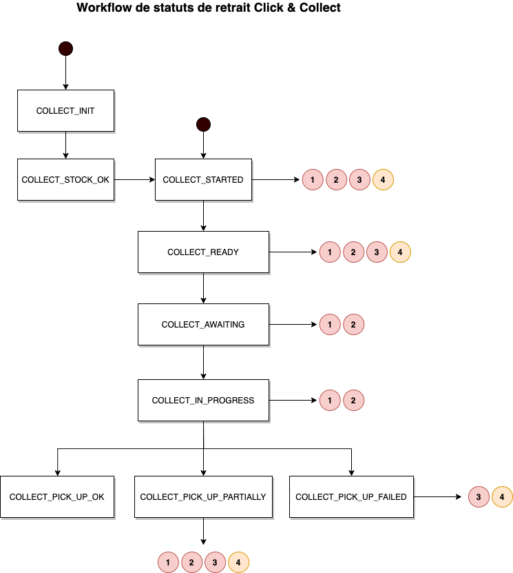
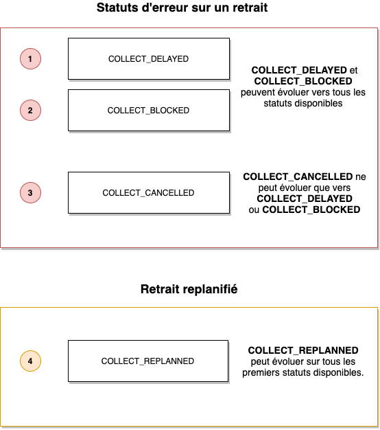

# Statuts de retrait en click & collect

Au cours de son cycle de vie la demande de retrait en click & collect passe tour à tour par plusieurs statuts. Ceux que nous identifions sont les différents stades de la demande. 

### Parcours d'une demande de retrait

### Liste des statuts de livraison possible

| Statut                      | Intitulé                                     | Description                                                                                |
| --------------------------- | -------------------------------------------- | ------------------------------------------------------------------------------------------ |
| `COLLECT_INIT`              | Initialisation de la commande                | Demande de retrait récupérée par Woop.                                                     |
| `COLLECT_STOCK_OK`          | Stock vérifié                                | Le produit demandé est disponible pour un retrait C&C                                      |
| `COLLECT_STARTED`           | Créneau validé                               | Le créneau de retrait C&C a été validé par le client                                       |
| `COLLECT_READY`             | Commande prête                               | Prépration C&C terminée en magasin, la commande client est prête                           |
| `COLLECT_AWAITING`          | Client arrivé en magasin                     | Le client est arrivé en magasin et attent d'être pris en charge par un vendeur             |
| `COLLECT_IN_PROGRESS`       | Retrait en cours                             | Prise en charge du client par le magasin                                                   |
| `COLLECT_PICK_UP_OK`        | Retrait effectué                             | La commande C&C a bien été récupérée par le client                                         |
| `COLLECT_PICK_UP_FAILED`    | Retrait en echec                             | La commande C&C n'a pas été récupérée par le client                                        |
| `COLLECT_PICK_UP_PARTIALLY` | Retrait partiel                              | La commande C&C n'a pas été récupérée entièrement par le client et devra être replanifiée. |
| `COLLECT_CANCELLED`         | Retrait C&C annulée                          | La commande C&C a été annulée                                                              |
| `COLLECT_BLOCKED`           | Retrait C&C bloqué                           | La commande C&C est bloquée est ne peut pas suivre son parcours correctement               |
| `COLLECT_DELAYED`           | Retrait C&C retardé                          | La commande C&C est retardée pour diverses raison propre au magasin                        |
| `COLLECT_REPLANNED`         | Créneau de retrait replannifié par le client | La commande C&C a été replainifée sur un autre créneau                                     |

### Gestion des erreurs

